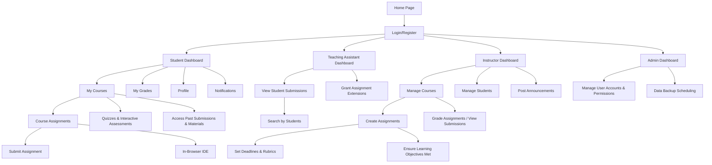
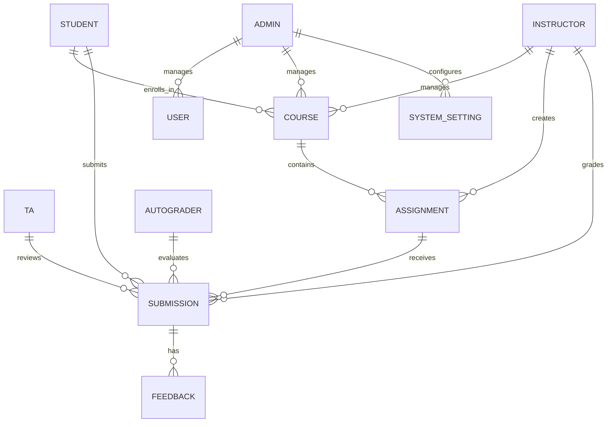

```mermaid

flowchart TD
    %% Home/Login
    Home[Home Page] --> Login[Login/Register]

    %% Dashboards based on role
    Login --> StudentDash[Student Dashboard]
    Login --> InstructorDash[Instructor Dashboard]
    Login --> AdminDash[Admin Dashboard]
    Login --> TA[Teaching Assistant Dashboard]

    %% Student Dashboard
    StudentDash --> S1[My Courses]
    StudentDash --> S2[My Grades]
    StudentDash --> S3[Profile]
    StudentDash --> S4[Notifications]
    S1 --> S5[Course Assignments]
    S5 --> S6[Submit Assignment]
    S5 --> S7[In-Browser IDE]
    S1 --> S9[Quizzes & Interactive Assessments]
    S1 --> S10[Access Past Submissions & Materials]

    %% TA Dashboard
    TA --> TA1[View Student Submissions]
    TA --> TA3[Grant Assignment Extensions]
    TA1 --> TA5[Search by Students]

    %% Instructor Dashboard
    InstructorDash --> I1[Manage Courses]
    InstructorDash --> I2[Manage Students]
    InstructorDash --> I3[Post Announcements]
    I1 --> I4[Create Assignments]
    I4 --> I5[Set Deadlines & Rubrics]
    I4 --> I6[Ensure Learning Objectives Met]
    I1 --> I8[Grade Assignments / View Submissions]

    %% Admin Dashboard
    AdminDash --> A1[Manage User Accounts & Permissions]
    AdminDash --> A4[Data Backup Scheduling]

```

    

``` mermaid  
erDiagram
    %% Roles
    STUDENT ||--o{ COURSE : enrolls_in
    STUDENT ||--o{ SUBMISSION : submits

    TA ||--o{ SUBMISSION : reviews
    INSTRUCTOR ||--o{ COURSE : manages
    INSTRUCTOR ||--o{ ASSIGNMENT : creates
    INSTRUCTOR ||--o{ SUBMISSION : grades

    ADMIN ||--o{ USER : manages
    ADMIN ||--o{ COURSE : manages
    ADMIN ||--o{ SYSTEM_SETTING : configures

    %% Core Learning Elements
    COURSE ||--o{ ASSIGNMENT : contains
    ASSIGNMENT ||--o{ SUBMISSION : receives
    SUBMISSION ||--o{ FEEDBACK : has
    AUTOGRADER ||--o{ SUBMISSION : evaluates

```
